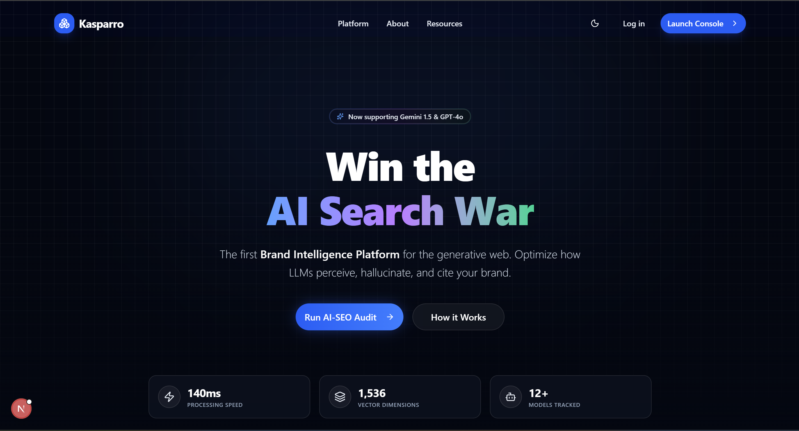

# 🚀 Kasparro - AI Visibility & Optimization Platform


---



---
## 🔗 Quick Links

- **🚀 Live API Demo:** [https://kasparro-frontend.vercel.app/](https://kasparro-frontend.vercel.app/)

---
## 📌 Project Overview

Kasparro is a next-generation dashboard designed to audit, analyze, and optimize brand visibility across Large Language Models (LLMs) like GPT-4, Claude 3, and Gemini. It acts as middleware between your content and the AI models that shape public perception.

---
## 🚀 Features

-   **Real-Time Dashboard**: High-level overview of AI Visibility Scores, Trust/EEAT metrics, and trend analysis.
-   **AI Audit Suite**: A comprehensive master-detail interface for analyzing specific modules:
    -   *LLM Crawlability*: Robots.txt & user-agent validation.
    -   *Context Window Fit*: Token density optimization.
    -   *Entity Authority*: Knowledge graph validation.
    -   *Sentiment Analysis*: Brand perception monitoring.
-   **Master-Detail Navigation**:
    -   **Desktop**: Persistent sidebar for quick module switching.
    -   **Mobile**: Optimized slide-out drawer (Sheet) for easy navigation on small screens.
-   **"Dark Glass" Aesthetic**: A premium, immersive UI featuring adaptive grid backgrounds, radial glows, and glassmorphism effects.
-   **Responsive Design**: Fully fluid layouts that adapt from large desktop grids to mobile-first interfaces.

---
## 🛠️ Tech Stack

-   **Framework**: [Next.js 14](https://nextjs.org/) (App Router)
-   **Language**: [TypeScript](https://www.typescriptlang.org/)
-   **Styling**: [Tailwind CSS](https://tailwindcss.com/)
-   **UI Components**: [shadcn/ui](https://ui.shadcn.com/) (Cards, Sheets, Badges, Buttons)
-   **Icons**: [Lucide React](https://lucide.dev/)
-   **State Management**: [Zustand](https://github.com/pmndrs/zustand)
-   **Theming**: `next-themes` (Dark/Light mode support)

---
## 📂 Project Structure

```bash
src/
├── app/
│   ├── (dashboard)/        # Protected application routes
│   │   ├── app/
│   │   │   ├── audit/      # The main Audit Master-Detail page
│   │   │   ├── dashboard/  # Overview metrics page
│   │   │   └── layout.tsx  # Dashboard layout wrapper
│   │   └── layout.tsx      # Root layout for app group
│   ├── (public)/           # Public facing pages (Platform, Landing)
│   │   └── platform/       # "Intelligence Pipeline" page
│   └── layout.tsx          # Root application layout
├── components/
│   ├── layout/
│   │   ├── DashboardHeader.tsx # Global header with mobile nav integration
│   │   └── Sidebar.tsx         # Desktop sidebar component
│   └── ui/                 # Reusable shadcn/ui components
├── lib/
│   ├── store.ts            # Global state (Zustand)
│   └── utils.ts            # Tailwind class merger (cn)
└── data/                   # Mock data for demos
```

---
## 🚀 Getting Started
1. Clone the repository:
```bash
git clone [https://github.com/Navin0062/kasparro-frontend.git](https://github.com/Navin0062/kasparro-frontend.git)
cd kasparro-frontend
```
2. Install dependencies:
```bash
npm install
```

3. Run the development server:
```bash
npm run dev
```
4. Open your browser: Navigate to `http://localhost:3000` to see the application.

---
## 🎨 Customization

- **Changing the Theme**
The application supports light and dark modes out of the box. To force a specific default theme, modify `app/layout.tsx` :
```bash
<ThemeProvider attribute="class" defaultTheme="dark" enableSystem={false}>
  {children}
</ThemeProvider>
```
- **Adding New Audit Modules**
To add a new module to the Audit page:

1. Open `src/app/(dashboard)/app/audit/page.tsx`.

2. Add a new object to the `MODULES` constant with a unique `id`, `label`, and scoring logic.

3. The UI will automatically render it in the sidebar and mobile drawer.

---
## 🤝 Contributing
Contributions are welcome! Please feel free to submit a Pull Request.

---
## 📄 License
This project is licensed under the MIT License.
